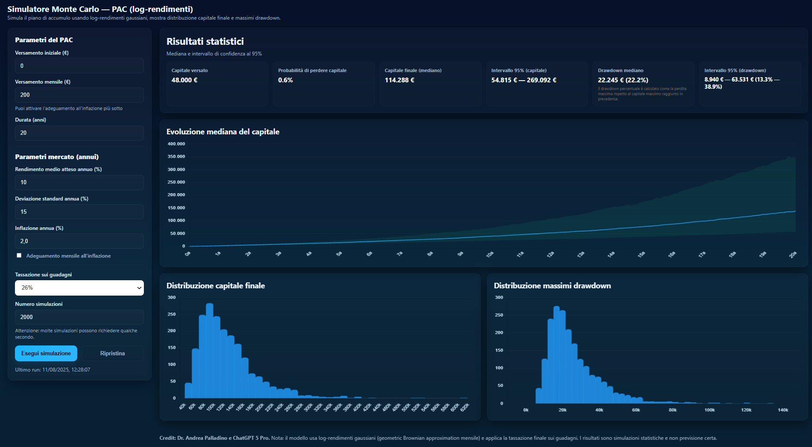

# Simulatore Monte Carlo di un PAC

## Descrizione

Questa applicazione a pagina singola simula l’andamento di un Piano di Accumulo Capitale (PAC) tramite simulazioni Monte Carlo basate su log-rendimenti gaussiani (modello geometric Brownian mensile).

L’app mostra graficamente e testualmente l’evoluzione del capitale investito, la distribuzione finale del capitale, i massimi drawdown e altre statistiche rilevanti per aiutare a valutare i rischi e i potenziali risultati dell’investimento.

---

## Parametri di Input

L’utente può personalizzare i seguenti parametri:

- **Versamento iniziale (€)**: capitale versato una tantum all’inizio  
- **Versamento mensile (€)**: quota versata ogni mese  
- **Durata (anni)**: periodo totale dell’investimento  
- **Rendimento medio atteso annuo (%)**: rendimento medio previsto ogni anno  
- **Deviazione standard annua (%)**: volatilità attesa dei rendimenti  
- **Tassazione sui guadagni**: scelta tra 0%, 12.5% e 26%  
- **Numero di simulazioni Monte Carlo**: da 100 in su, più è alto più l’analisi è precisa ma richiede tempo  
- **Adeguamento mensile all’inflazione**: attivabile per far crescere i versamenti in linea con l’inflazione attesa  

---

## Output e Risultati

L’app produce sia output grafici che testuali:

- **Grafici**:  
  - Evoluzione del capitale nel tempo per ciascuna simulazione  
  - Distribuzione del capitale finale al termine del periodo  
  - Distribuzione dei massimi drawdown raggiunti in ogni simulazione  

- **Valori numerici**:  
  - Capitale complessivamente versato  
  - Valore mediano finale del capitale  
  - Intervallo di confidenza al 95% del capitale finale  
  - Valore mediano del massimo drawdown  
  - Intervallo di confidenza al 95% del drawdown  
  - Probabilità che il capitale finale sia inferiore al capitale versato (rischio di perdita reale)  

---

## Metodo di simulazione

La simulazione è basata su una distribuzione gaussiana dei **log-rendimenti mensili**, assumendo che il capitale segua un processo di tipo geometric Brownian motion mensile. La tassazione viene applicata al guadagno finale. Il modello permette di generare molteplici scenari futuri per analizzare la variabilità e il rischio.

---

## Collaborazione

Questa applicazione è stata realizzata da Andrea Palladino in collaborazione con **ChatGPT 5 Pro**, che ha effettuato la progettazione e lo sviluppo del codice sulla base del seguente prompt:

> *Crea un'applicazione a pagina singola in un unico file HTML con i seguenti requisiti:  
> Nome: Simulatore Monte Carlo di un PAC  
> - Obiettivo: Simulare l'andamento di un PAC usando una simulazione Monte Carlo. Mostrare fra i risultati grafici l'evoluzione del capitale, la distribuzione del capitale finale e la distribuzione dei massimi drawdown realizzati durante l'investimento. Mostrare fra i risultati testuali il capitale versato, il valore mediano finale dell'investimento e l'intervallo al 95%, il valore mediano del drawdown e l'intervallo al 95%. Indica anche la probabilità di recuperare meno di quanto si è investito al termine dell'investimento.  
> - Funzioni: Dare la possibilità all'utente di inserire il versamento iniziale, il versamento mensile, il numero di anni che è disposto a investire, il rendimento annuo medio atteso, la deviazione standard attesa, la tassazione (possibile scelta tra 0%, 12.5% e 26%), il numero di simulazioni Monte Carlo. Dare la possibilità di inserire l'adeguamento della quota mensile all'inflazione. Ricordati che è la distribuzione dei log-rendimenti ad essere gaussiana, non quella dei rendimenti.  
> - L'interfaccia utente deve essere pulita, con testo ad alto contrasto, di facile utilizzo ma accattivante. L'area in cui l'utente inserirà i suoi input deve essere ben separata dall'area in cui verranno mostrati i risultati testuali e grafici. Inserisci in basso "Credit: Andrea Palladino e GPT-5 Pro" e inserisci una nota per spiegare in che modo viene effettuata la simulazione Monte Carlo.*

---

## Come usare l’app

1. Aprire il file HTML in un browser moderno (funziona offline).  
2. Inserire i parametri personalizzati nella sezione “Parametri del PAC” e “Parametri mercato”.  
3. Cliccare su **Esegui simulazione** e attendere il completamento (il tempo dipende dal numero di simulazioni).  
4. Esplorare i risultati grafici e testuali nella sezione di output.  
5. Per effettuare una nuova simulazione, cliccare su **Ripristina**.

---

## Crediti

**Credit:** Dr. Andrea Palladino e ChatGPT 5 Pro.

---

> **Nota:** Questo simulatore fornisce stime statistiche basate su un modello semplificato e non rappresenta una previsione certa o una consulenza finanziaria.

